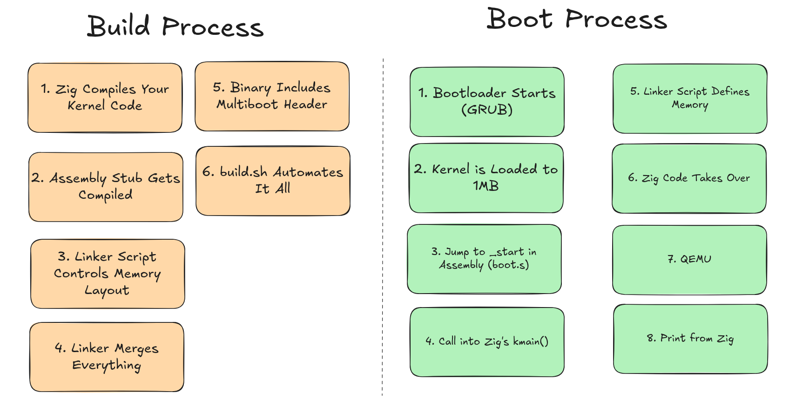

# ZOS

A very tiny OS written in Zig, which can be run on QEMU.


### Rationale

* Very minimalist
* Easy to understand
* Great for Learning
* Altought does not anything useful it should how Zig can be used to write an OS
* Fun

### Build

```bash
./build.sh
```

### Run

```bash
./run.sh
```

### Result


### How it works?

`boot.s` (Assembly)
1. Bootloader (like GRUB) finds the Multiboot header
2. Loads the kernel into memory at 1MB (as specified in `link.ld`)
3. Jumps to `_start`
4. `_start` calls Zig `kmain()` function
5. kernel takes control and runs

`link.ld` (Linker Script)
1. Declares `_start` as the program's entry point
2. When a bootloader loads the kernel, it will jump to this symbol
3. This corresponds to the `_start` label in `boot.s` assembly file
4. Memory Layout Configuration
5. `SECTIONS` block defines how sections are arranged in memory
6. `. = 1M` sets the location counter to 1 megabyte
7. 1MB is chosen because it's above the first megabyte, which contains:
 * Real-mode interrupt vectors (0x0000-0x03FF)
 * BIOS data area (0x0400-0x04FF)
 * Video memory (0xA0000-0xFFFFF)
 * BIOS ROM (0xF0000-0xFFFFF)
8. Section Organization - Text Section (Executable Code)
9. `.text:` Contains all executable code
10. Bootloaders scan the first 8KB for this header
11. Data Section (Initialized Data)
12. `.data:` Contains initialized global and static variables

### How It All Works Together

1. Compilation: source files are compiled into object files
2. Linking: The linker uses this script to combine object files
3. Memory Layout: Creates a binary with this structure:
```
0x100000 (1MB): Multiboot header
                kernel code (_start, kmain, etc.)
                Read-only data (strings, constants)
                Initialized variables
                Space reserved for uninitialized variables
```
4. Bootloader: Loads the binary at 1MB, finds the Multiboot header, jumps to `_start`
5. Execution: kernel runs starting from the `_start` symbol

